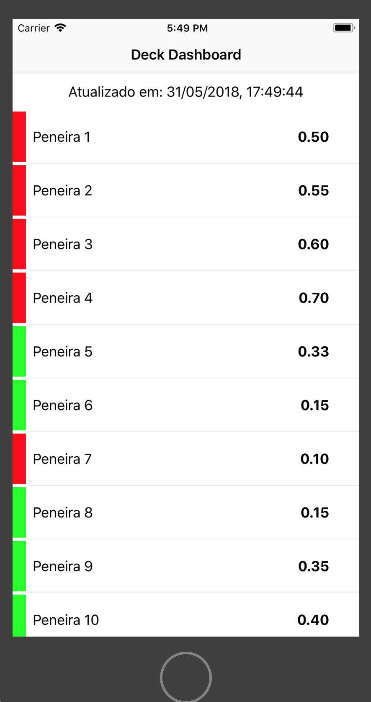
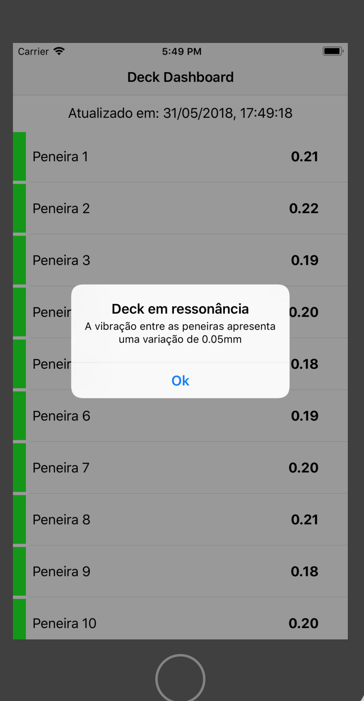

# Manufacturing
## Este projeto é composto de duas partes:
- backend - Serviço que expoe via webservice (python) os dados fornecidos por cada medidor a ser analisado
- frontend - Aplicativo desenvolvido em swift para buscar os dados no webservice e exibir um dashboard na tela do smartphone.

# Setup
## Baixando o projeto ele está configurado para rodar todo no ambiente local.

Acessar via shell a pasta do projeto Backend e executá-lo.
python Ressonance.py

Abrir o projeto Peneira.xcodeproj no XCode.
Executar ele em um simulador.

## Para rodar o aplicativo em um dispositivo físico, alterar nos seguintes lugares:
- alterar o arquivo "Ressonance.py" do backend para adicionar o IP externo da máquina
- alterar no projeto "Peneira", no arquivo "CheckController" a baseURL para conter o endereço IP adicionado no passo anterior

# Screenshots do projeto

